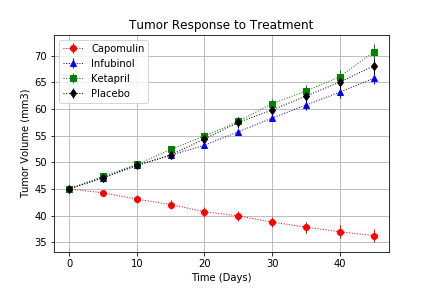
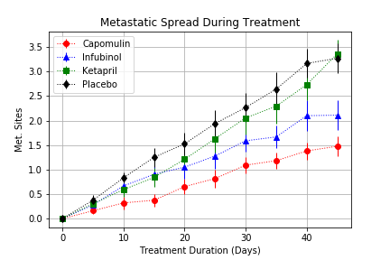
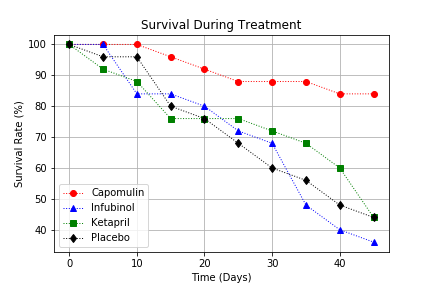

# Pymaceuticals Report

1. The first noticable trend is that when looking at the effect on tumor size, all the drugs apartment from Capomulin were indistinguishable from the Placebo. You can see in the figure below that the tumor size increased on all drugs except for Capomulin

2. When looking at the number of sites that the squamous cell carcinoma had metastasized, we can see that as expected, Capomulin ended at the lowest number at ~1.5 with an error margin of +/- 0.25. Interestingly, Infubinol also had a visibly smaller number of metastatic sites at the end of the treatment with the mean value at ~2.1. While the standard error there was relatively high for Infubinol, the number of metastatic sites still didn't quite overlap Capomulin so we can say that treatment under Capomulin still resulted in a significantly lower number of metastatic sites when compared to other drugs

3. And finally for the most important statistic, survival rate on Capomulin (85%) by the end of the treatment was almost twice as high when compared to the other drugs (~45%)

